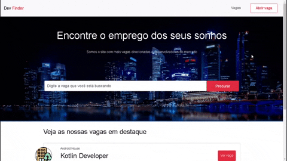

# DevFinder
<br><br>
Este é meu primeiro projeto com NodeJS, e a descrição dele está logo abaixo:

Este projeto se trata de um portal de vagas(responsivo) especializado em vagas para desenvolvedores, eu gostei muito de desenvolvê-lo e também achei o resultado final muito bom, você pode ver um pouco do resultado final mais abaixo, e após os resultados finais você pode ver como rodar o projeto em sua máquina.

## Tecnologias utilizadas :rocket:

- HTML5, CSS3 e Bootstrap 4
- NodeJS
- Express
- Express Handlebars
- Sequelize
- SQLite

<hr>

## Objetivo do projeto :dart:

Meu objetivo ao desenvolver este projeto foi principalmente adquirir conhecimentos práticos com NodeJS, o que sinto que consegui afinal consegui entender como o desenvolvimento back-end funciona e certamente continuarei adquirindo novos conhecimentos nessa área.

<hr>

## Funcionamento da aplicação :on:

Como este foi meu primeiro projeto utilizando essas tecnologias, o funcionamento é bem simples, o usuário pode entrar no portal e pesquisar por alguma vaga, ou descer e olhar a lista de todas as vagas, caso ele queira abrir uma vaga ele pode clicar em "Abrir vaga", preencher o formulário e então abrir a vaga, bem simples e rápido, você pode ver o resultado final logo abaixo:

<hr>

## Resultado final :framed_picture:
   ### Pequeno video com o resultado final e o funcionamento da aplicação :film_strip:
   Eu também fiz um pequeno video com menos de um minuto da aplicação rodando, você pode vê-lo clicando aqui: https://youtu.be/wLp4pQC9K5g
   
   ### Home
   
   
   ### Cadastrando vaga
   
 
<hr>

## Como executar o projeto em sua máquina :arrow_forward:

Para utilizar a aplicação, você precisará ter o [Git](https://git-scm.com) e o [Node.JS/NPM](https://nodejs.org/en/) instalados em seu computador.

Após ter instalado eles, clique com o botão direito do mouse dentro de algum diretório de seu computador e escolha a opção "Git Bash Here", isso abrirá um terminal de linha de comando, agora basta seguir os seguintes passos:

### Baixando o projeto
```bash
# Clone o repositório em algum diretório de seu computador
$ git clone https://github.com/TiagoDiass/DevFinder.git

# Entre no repositório
$ cd DevFinder
```

Após ter entrado na raiz do projeto(na pasta DevFinder), você só precisará instalar as dependências e iniciar o projeto:

```bash

# Instale as dependências
$ npm install

# Inicie a aplicação
$ npm start
```

Após ter realizado estes passos, o projeto estará rodando na porta 3000 da sua máquina, basta entrar em seu browser e digitar "localhost:3000" na barra de endereços de seu navegador, e lá estará o projeto funcionando :D
